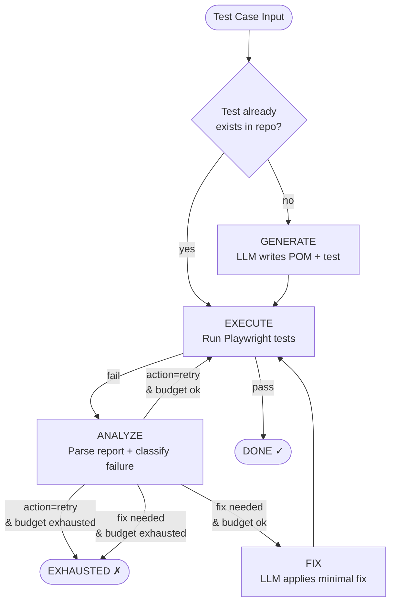
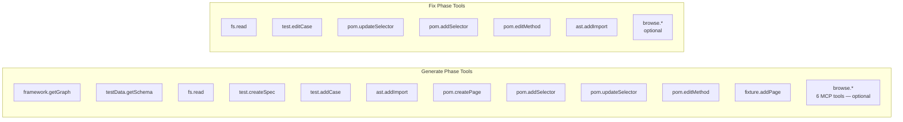
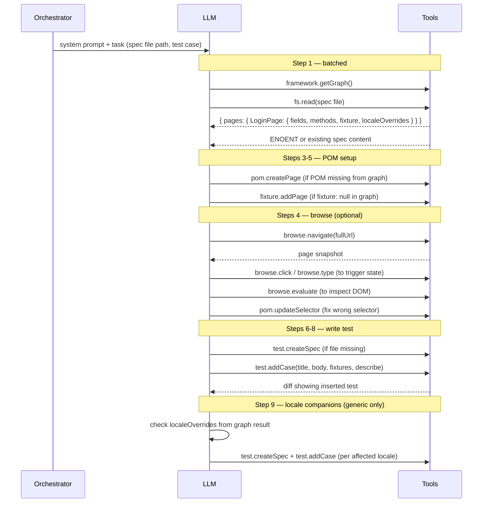
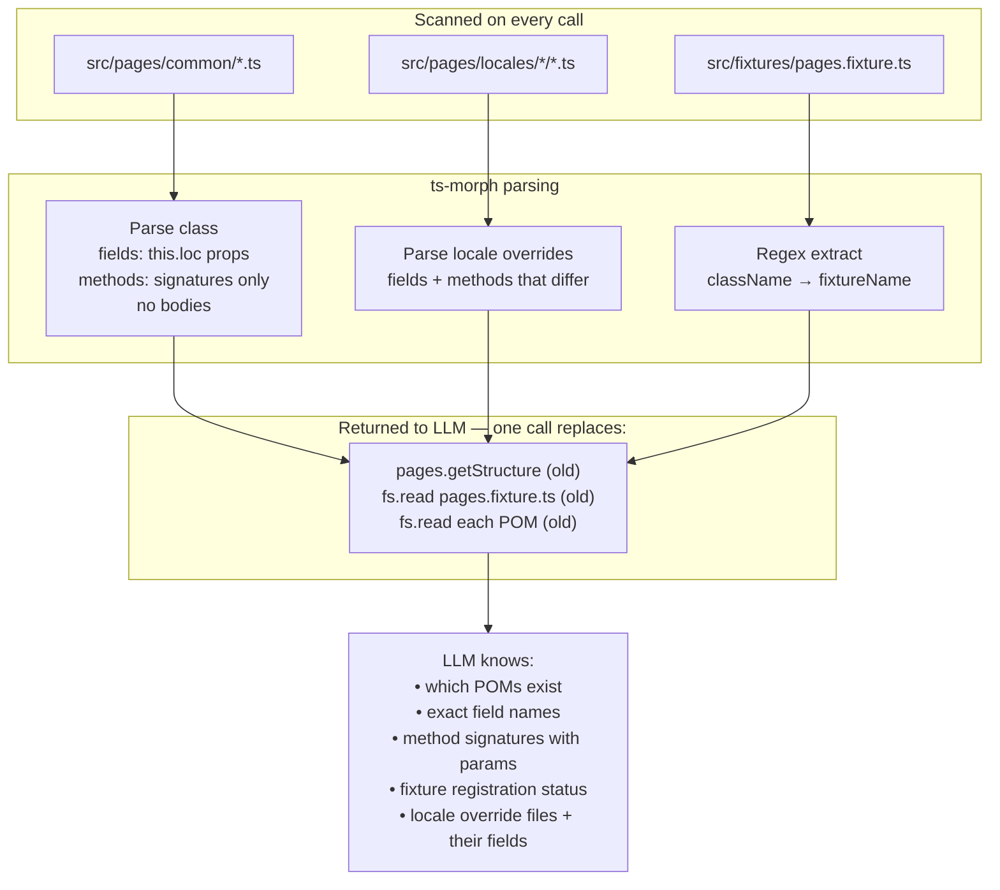
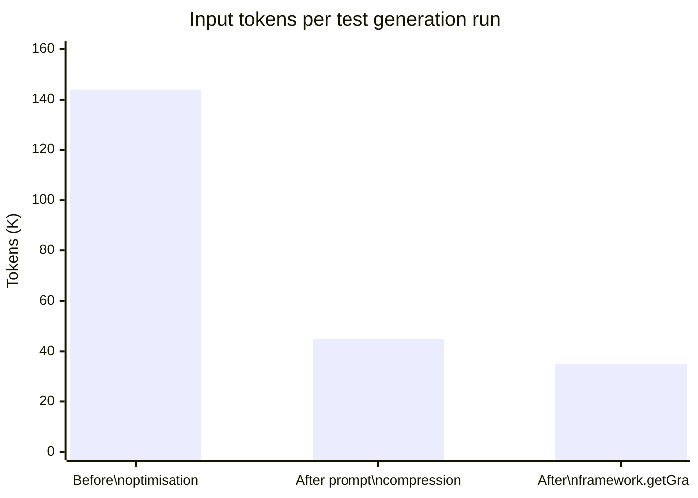

# QA Agent — Architecture

## 1. Orchestrator Phase Flow



---

## 2. Tool Registry by Phase



---

## 3. Generate Phase — Step Sequence



---

## 4. framework.getGraph — Data Flow



---

## 5. fixture.addPage — Self-Healing Logic

```mermaid
flowchart TD
    START([fixture.addPage called]) --> IC{PageFixtures type\nalready has fixtureName?}
    IC -- yes --> NOOP([return changed:false])
    IC -- no --> IMP[Add import for className]

    IMP --> CT{PageFixtures\ntype exists?}
    CT -- no --> CRT[Insert\ntype PageFixtures = {}\\nafter last import]
    CT -- yes --> AP
    CRT --> AP[addProperty\nfixtureName: ClassName\nto type literal]

    AP --> TV{export const test\n= base.extend exists?}
    TV -- no --> CRE[Insert\nexport const test = base.extend&lt;PageFixtures&gt;\nbefore first export declaration]
    TV -- yes --> APA
    CRE --> APA[addPropertyAssignment\nfixtureName: async fn\nto extend object]

    APA --> SAVE([Save + return diff])
```

---

## 6. Token Budget — Before vs After



> **Key savings:**
> - System prompt: 3,362 → 1,202 tokens (64% reduction)
> - `framework.getGraph` replaces: `pages.getStructure` + `fs.read pages.fixture.ts` + 3–4 individual POM `fs.read` calls
> - Step 9 locale check: no extra tool call — uses graph result from step 1
> - `fixture.addPage` no longer silently skips when skeleton is missing — prevents re-creation loops

---

## 7. Source Tree

```
src/
├── orchestrator/
│   ├── qaAgent.ts          # phase loop, tool registry setup
│   ├── prompts.ts          # system prompt + task prompt builders
│   ├── testCase.ts         # TestCase type + renderer
│   └── state.ts            # phase state machine
│
├── tools/
│   ├── framework/
│   │   └── getGraph.ts     # ★ NEW — full POM inventory (fields, sigs, fixtures, locales)
│   ├── pages/
│   │   └── getStructure.ts # deprecated — superseded by framework.getGraph
│   ├── testdata/
│   │   └── getSchema.ts    # ★ NEW — real field names from src/data/ JSON files
│   ├── test/
│   │   ├── addCase.ts      # insert test into describe block (always uses describe)
│   │   ├── createSpec.ts
│   │   ├── editCase.ts
│   │   └── findCase.ts
│   ├── pom/
│   │   ├── createPage.ts
│   │   ├── addSelector.ts
│   │   ├── updateSelector.ts
│   │   └── editMethod.ts
│   ├── fixture/
│   │   └── addPage.ts      # ★ FIXED — self-heals missing type + extend skeleton
│   ├── ast/
│   │   └── addImport.ts
│   └── fs/
│       └── read.ts
│
├── ast/
│   ├── testInserter.ts     # ★ FIXED — always inserts inside describe block
│   ├── importEditor.ts
│   ├── diff.ts
│   └── project.ts
│
├── agent/
│   ├── loop.ts             # LLM ↔ tool call loop
│   └── conversationLog.ts
│
├── llm/
│   └── anthropicClient.ts
│
├── failure/
│   ├── classify.ts         # rule-based failure classifier
│   └── rules.ts
│
└── mcp/
    └── playwrightServer.ts # browse.* MCP tools (optional, config-gated)
```
